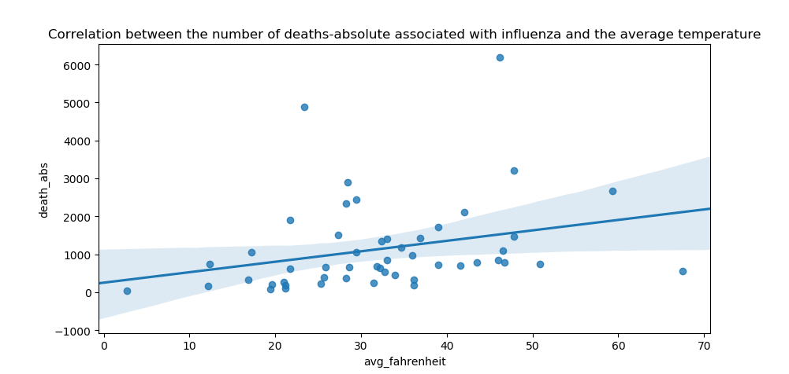
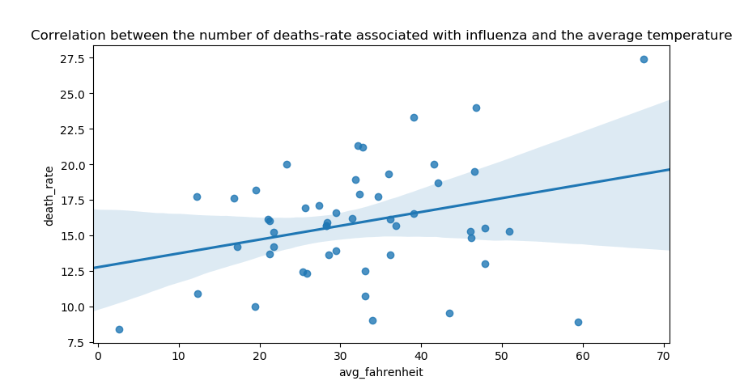

#Analysis of data

##**Analysis**

Influenza (flu) viruses can be detected year-round in the United States. But historical data from the CDC has evidence that there is a seasonal component in the spread of the disease, being much more common during the fall and winter.

CDC stands for Center for Disease Control and Prevention. It is one of the major operating components of the Department of Health and Human Services of the United States.

At the first sight, a question pops up: is the cold responsible for you to get sick?

You are a data scientist helping the CDC to answer this question. There are two datasets available for this analysis.

1. The number of deaths and the death rate associated with the Influenza virus by State in 2015;

2. The average temperature during the winter season from 2015/2016 by State;

Disclaimer: 

    The number of deaths and death rate associated with the influenza was downloaded from the CDC;
    Death rate is the number of deaths by 100,000 of population;
    The average temperature is an estimate roughly calculated to this case study;

**My observation:**

When I merged two tables, I created a function that receives a temperature in Celsius and converts it to Fahrenheit and add new row – avg.Fahrenheit. 

Then I calculated the Pearson’s correlation coefficient to determine if the number of deaths associated with influenza and the average temperature are correlated.

I did the same thing to the death rate, instead of absolute numbers.

The outcome was :

    correlation the death rate-the average temperature : weak positive

    correlation the death abs-the average temperature : no relationships

Conclusion:

There is **no statistically significant correlation** between the number of deaths and the average temperature, so the cold is not responsible for you to get sick.

# data_analysis
https://brankicajovanovic81.wordpress.com/analysis-of-data/
